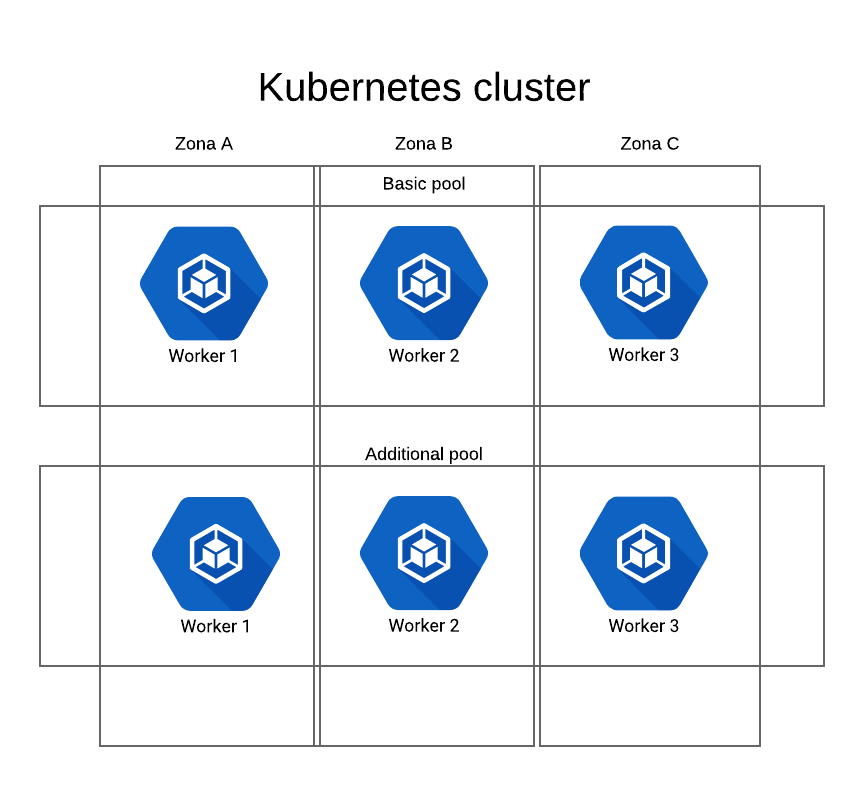

# Overview
GKE Kubernetes module with node pools submodule




Table of contents
=================

   * [Overview](#overview)
   * [Table of contents](#table-of-contents)
      * [1. Features](#1-features)
      * [2. Usage](#2-usage)
         * [cluster with default node pool on preemptible](#cluster-with-default-node-pool-on-preemptible)
         * [cluster with explicit definition of node pools (optional)](#cluster-with-explicit-definition-of-node-pools-optional)
         * [multiple clusters](#multiple-clusters)
         * [add nat module (optional)](#add-nat-module-optional)
         * [using an existing or creating a new vpc network](#using-an-existing-or-creating-a-new-vpc-network)
         * [subnetworks](#subnetworks)
      * [3. Authors](#3-authors)
      * [4. License](#4-license)
      * [4. Acknowledgments](#4-acknowledgments)


## 1. Features

- multiple node pools with node number multiplied by defined zones
- node pools with autoscaling enabled (scale to 0 nodes available)
- node pools with preemptible instances
- ip_allocation_policy for exposing nodes/services/pods in VPC
- tested with NAT module

## 2. Usage

### cluster with default node pool on preemptible
```hcl
module "primary-cluster" {
  name                   = "${terraform.workspace}"
  source                 = "github.com/russmedia/terraform-google-kubernetes-cluster?ref=1.5.2"
  region                 = "${var.google_region}"
  zones                  = "${var.google_zones}"
  project                = "${var.project}"
  environment            = "${terraform.workspace}"
  tags                   = ["nat-${terraform.workspace}"]
  min_master_version     = "${var.master_version}"
}
```

### cluster with explicit definition of node pools (optional)

```hcl
module "primary-cluster" {
  name                   = "${terraform.workspace}"
  source                 = "github.com/russmedia/terraform-google-kubernetes-cluster?ref=1.5.2"
  region                 = "${var.google_region}"
  zones                  = "${var.google_zones}"
  project                = "${var.project}"
  environment            = "${terraform.workspace}"
  min_master_version     = "${var.master_version}"
  node_pools             = "${var.node_pools}"
}
```

and in variables:

```hcl
node_pools = [
  {
    name                = "default-pool"
    initial_node_count  = 1
    min_node_count      = 1
    max_node_count      = 3
    version             = "1.10.7-gke.6"
    image_type          = "COS"
    machine_type        = "n1-standard-1"
    preemptible         = true
    tags                = "tag1 nat"
  },
]
```
**Note: at least one node pool must have `initial_node_count` > 0.**

###  multiple clusters

Due to current limitations with depends_on feature and modules it is advised to create vpc network separately and use it when defining modules, i.e: 

```hcl
resource "google_compute_network" "default" {
  name                    = "${terraform.workspace}"
  auto_create_subnetworks = "false"
  project                 = "${var.project}"
}
```

```hcl
module "primary-cluster" {
  name        = "primary-cluster"
  source      = "../../terraform-google-kubernetes-cluster"
  region      = "${var.google_region}"
  zones       = "${var.google_zones}"
  project     = "${var.project}"
  environment = "${terraform.workspace}"
  network     = "${terraform.workspace}"
}
```

```hcl
module "secondary-cluster" {
  name                                 = "secondary-cluster"
  source                               = "../../terraform-google-kubernetes-cluster"
  region                               = "${var.google_region}"
  zones                                = "${var.google_zones}"
  project                              = "${var.project}"
  environment                          = "${terraform.workspace}"
  network                              = "${terraform.workspace}"
  nodes_subnet_ip_cidr_range           = "10.102.0.0/24"
  nodes_subnet_container_ip_cidr_range = "172.21.0.0/16"
  nodes_subnet_service_ip_cidr_range   = "10.201.0.0/16"
}
```
**Note: secondary clusters need to have nodes_subnet_ip_cidr_range nodes_subnet_container_ip_cidr_range and nodes_subnet_service_ip_cidr_range defined, otherwise you will run into IP conflict.**

### add nat module (optional)

Adding NAT module for outgoing Kubernetes IP:
```hcl
module "nat" {
  source     = "github.com/GoogleCloudPlatform/terraform-google-nat-gateway?ref=1.2.0"
  region     = "${var.google_region}"
  project    = "${var.project}"
  network    = "${terraform.workspace}"
  subnetwork = "${terraform.workspace}-nodes-subnet"
  tags       = ["nat-${terraform.workspace}"]
}
```

Note: remember to add tag `nat-${terraform.workspace}` to primary cluster tags and node pools so NAT module can open routing for nodes.

### using an existing or creating a new vpc network

Variable "network" is controling network creation. 
- when left empty (by default `network=""`) - terraform will create a vpc network - network name will be equal to `${terraform.workspace}`.
- when we define a name - this network **must already exist** within the project - terraform will create a subnetwork within defined network and place the cluster in it.

### subnetworks

Terraform always creates a subnetwork. The subnetwork name is taken from a pattern: `${terraform.workspace}-${var.name}-nodes-subnet`.

- we define a subnetwork nodes CIDR using `nodes_subnet_ip_cidr_range` variable - terraform will fail with conflict if you use existing netmask
- we define kubernetes pods CIDR using `nodes_subnet_container_ip_cidr_range` variable
- we define kubernetes service CIDR using `nodes_subnet_service_ip_cidr_range` variable

## 3. Authors

- [Eryk Zalejski](https://github.com/ezalejski)

- [Filip Haftek](https://github.com/filiphaftek)

- [Christoph Rosse](https://github.com/gries)

## 4. License

This project is licensed under the MIT License - see the LICENSE.md file for details.
Copyright (c) 2018 Russmedia GmbH.

## 4. Acknowledgments

- [Konrad Černý](https://github.com/rokerkony)